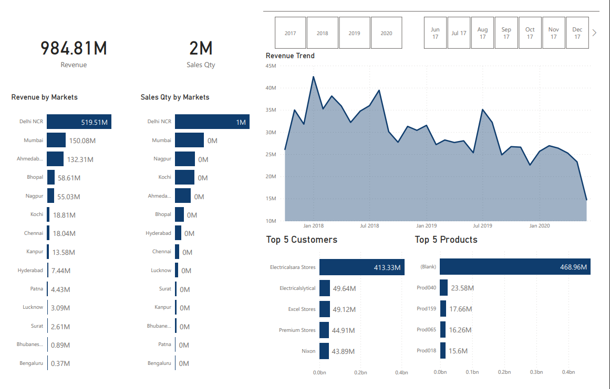

# 📊 Sales Insights Dashboard

## 🔍 Overview
This project focuses on analyzing company sales data to uncover trends, key revenue drivers, and actionable business insights.  
The goal is to support decision-making for **sales strategy, customer targeting, and regional performance management**.

## 📂 Dataset
- Source: Company sales dataset (simulated)  
- Key fields: Date, Product, Customer, Region, Sales, Profit  
- Records: ~50K+ transactions  

## 🛠️ Tools & Technologies
- **SQL** (for querying and data transformation)  
- **Power BI / Tableau** (for dashboarding)  
- **Excel** (for preprocessing and validation)  

## 📈 Key Features of Dashboard
- **Revenue by Region & Product** → Identified top-performing regions and products.  
- **Customer Segmentation** → Highlighted high-value customers driving ~60% of revenue.  
- **Time Series Analysis** → Seasonal spikes around Q2 and holiday season.  
- **Profitability Insights** → Certain products sold well but had low margins.  

## 💡 Business Insights
- Region **North-East** contributed the highest sales but with declining growth in the last 2 quarters.  
- **Product Category B** showed strong growth potential with high margins.  
- ~20% of customers generated ~70% of total sales (Pareto principle).  
- Discounts improved sales volume but reduced profitability.  

## 📸 Dashboard Preview

  
---

